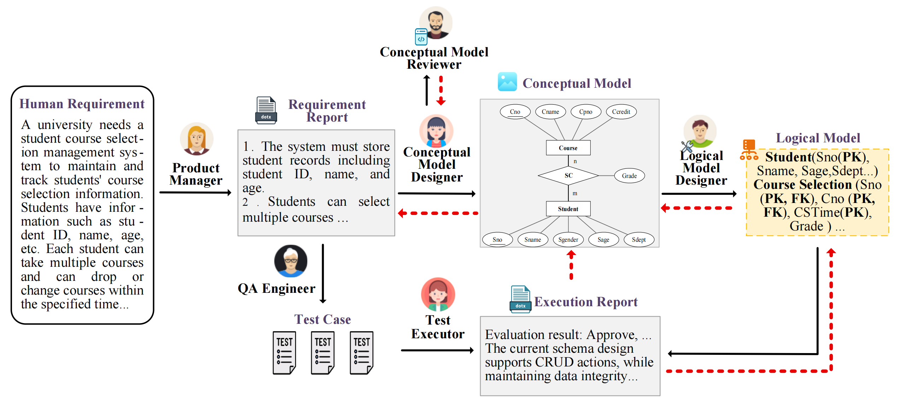

# SchemaAgent: Automated Relational Database Design System

## Project Introduction

SchemaAgent is an intelligent relational database design system that can automatically generate a complete database design based on user requirements, including conceptual model, logical model, and physical model. The system uses advanced AI technology to help users quickly build high-quality database structures without having to understand the complex details of database design.

## Project Goals

- Simplify the database design process and lower the design threshold
- Automatically generate logical data models based on user-described requirements
- Automatically generate complete physical DDL statements
- Provide comprehensive database design reports

## Project Components

<p align="center">
  
</p>

- **Manager Agent**: Analyzes user requirements, generates requirement analysis reports and result acceptance
- **Conceptual Designer Agent**: Generates entity-relationship models
- **Conceptual Reviewer Agent**: Reviews entity-relationship models
- **Logical Designer Agent**: Converts conceptual models into logical models. Considering data consistency issues, the logical model satisfies the third normal form.
- **QA Engineer Agent**: Responsible for generating test cases based on user requirements
- **Execution Agent**: Responsible for verifying whether the logical model can meet the test cases
- **Physical Designer Agent**: Generates DDL statements and recommends indexes

## Installation
1. Set up a virtual environment:
```bash
python -m venv schema
```

2. Install Python dependencies:
```bash
pip install -r requirements.txt
```

## Usage

### Generate Logical Model

This will generate results for all examples in the dataset.

#### Agent Method
In the project root directory, execute:
```bash
cd agent
python agent_chat.py
```
#### Prompt Method
```bash
python run.py
```

### Evaluation

You can get evaluation results by running evaluate.py

### Generate Physical DDL and Design Report

In the project root directory, execute:
```bash
cd physical_design
python gradio_interface.py
```

This will launch a web interface where you can:
1. Enter database requirement descriptions
2. Generate a complete database design
3. Download a complete database design report (PDF format)

## Example

Users can input requirements like:
```
A university needs a student course selection management system to maintain and track students' course selection information. 
Students have information such as student ID, name, age, the name of the course chosen by the student, etc. 
Each student can take multiple courses and can drop or change courses within the specified time. 
Each course has information such as course number, course name, credits, lecturer and class time. 
The popularity of a course depends on the number of students who take the course. 
The system can predict the popularity of the course and provide support for academic decision-making.
```

The system will automatically generate a complete database design including table structures, relationships, constraints, and indexes.


